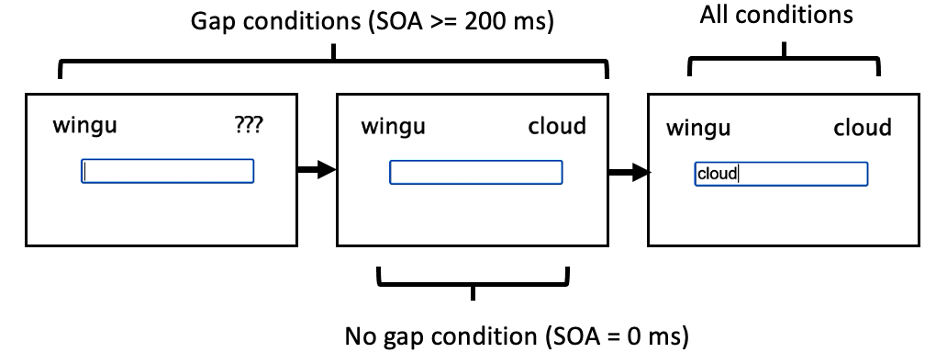
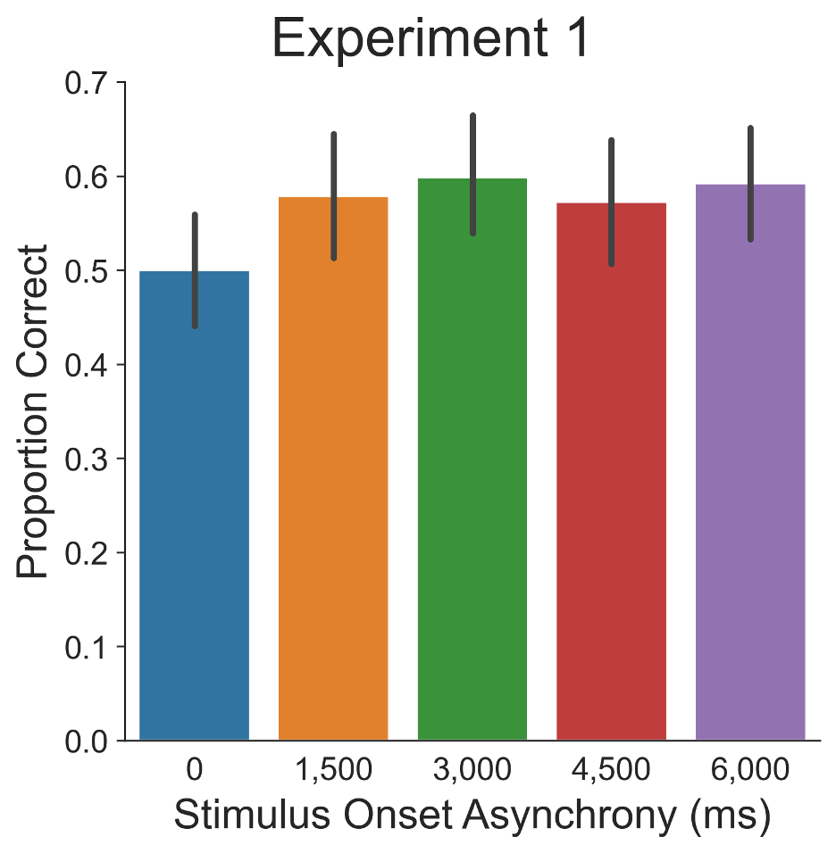
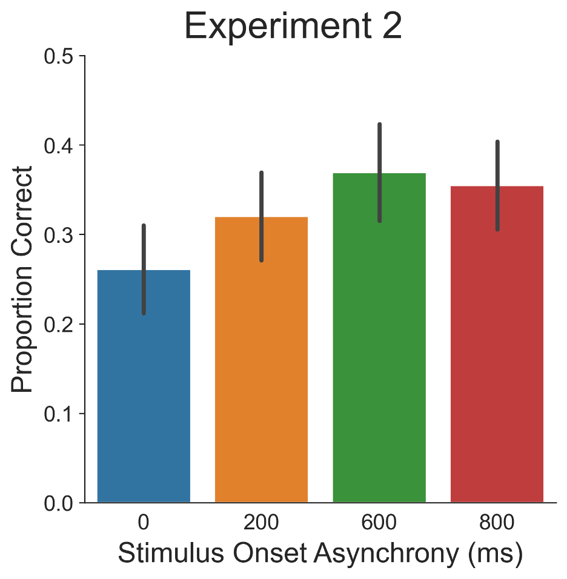
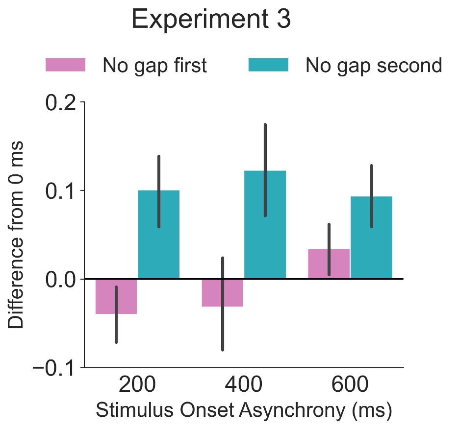
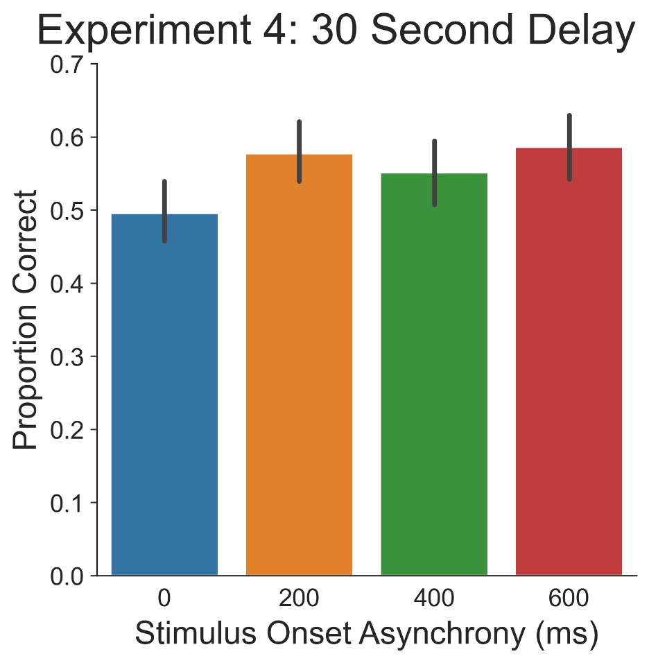
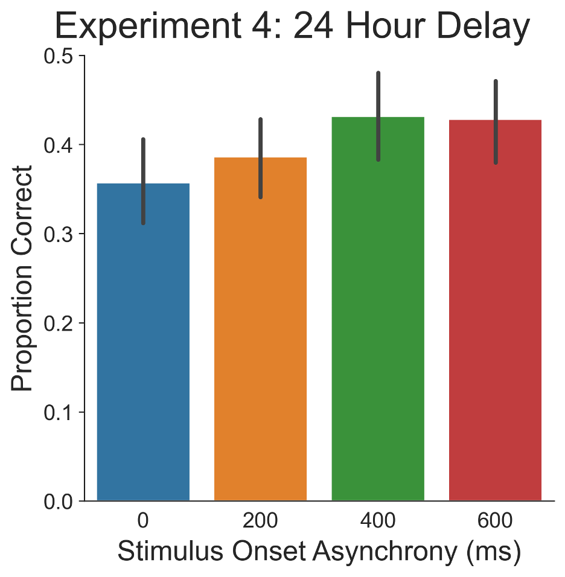

## A repository for the analysis and visualization code used in *How to enhance learning in less than one second* Reilly W.B., Antony. J.W., & Ranganath, C. (in prep)

### Project Description

The testing effect–the retention benefit of practicing retrieval compared to studying–and the pretesting effect–incorrectly guessing a target before learning compared to studying–demonstrate the advantages of retrieval-based learning, but no extant theories have accounted for both of these effects. Error-driven learning is the algorithm underlying the success of neural networks in which robust learning takes place by comparing a predicted pattern to a correct pattern. Here, we argue that retrieval involves the same kind of computation that takes place in neural networks.

According to our error-driven learning account, retrieval-based learning serves to “stress test” the human memory system, allowing it to learn to better predict a target from a cue, whereas in studying, there is no opportunity for the system to form a prediction because the target is already present. An alternative account holds that retrieval benefits learning because it allows learning from making errors. Here, we present results from four experiments designed to adjudicate between these two accounts. 

Participants learned Swahili-English translations in two types of conditions. In the “gap” conditions, the cue was presented before the target was presented, creating a gap during which a retrieval attempt could take place. In the “no gap” condition, the cue and the target were presented simultaneously. 

In three experiments, we found that a gap of only 600 ms was sufficient to enhance retention of word pairs compared to the no gap condition one day after learning. Due to the fact that participants made very few errors during learning, these results are consistent with the error-driven learning account and are inconsistent with the error-correction account.

The educational applications of these results are two-fold. These results show that participants do not receive marginal benefits from longer retrieval attempts than around one second, therefore formative assessment products may provide feedback relatively quickly, potentially reducing learner discomfort. A knock-on benefit of faster feedback presentation is that more learning trials may fit into the same learning block.  

### Contents

This repository includes the scripts used to munge, analyze, and visualize the data and the resulting figures. It also includes html files that contain the code and output from all statistical analyses.

### Key scripts

`preprocess_plot.py` Run interactively. Combines the two experimental phases, engineers features, identifies bad data, creates plots, outputs clean dataframes.

`stats.Rmd` Statistical analyses of learning data and cued-recall performance on the final test. Cued-recall was modeled with mixed-effects logistic regression to account for random variation among items and participants. Inference was conducted with a parametric bootstrap approach.

`stats.md` Same as above--but capable of rendering on GitHub.

`tfidf_check.py` tf-idf natural language processing technique used to identify spurious corrleations in incorrect final test performance to help identify individuals who used multiple accounts, i.e. bad data. 

### Figure 1. 

	

Experimental Design. There were two types of experimental condition. In "gap" conditions, there was a temporal gap between Swahili presentation and English word presentation. In "no gap" conditions, the Swahili and English words were presented simultaneously.

### Figure 2.

 
	

Experiment 1 Cued-recall Performance. Mean proportion correct on the final cued-recall test in Experiment 1. Error bars represent standard error of the mean.

### Figure 3. 

### Figure 4. 

	

### Figure 5. 

	

### Figure 6. 

	

### Tools

